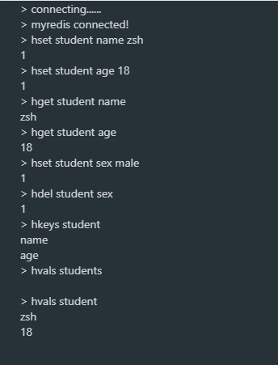
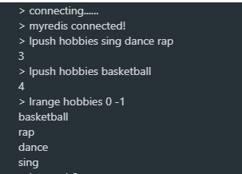
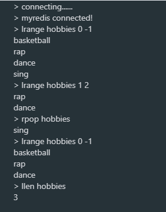
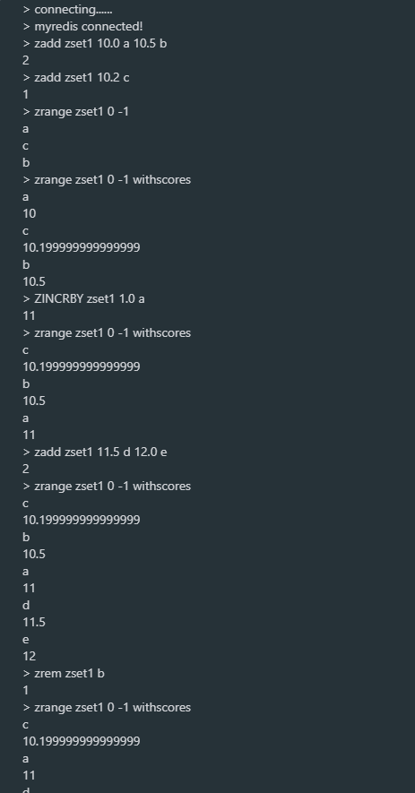
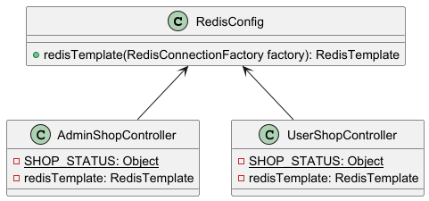

# Redis

> **参考视频或文章**：
>
> + 【黑马程序员Java项目实战《苍穹外卖》，最适合新手的SpringBoot+SSM的企业级Java项目实战】https://www.bilibili.com/video/BV1TP411v7v6?vd_source=b7f14ba5e783353d06a99352d23ebca9

## 一、技术介绍

### 1.概述

+ Redis是一个基于**内存**的key-value结构的数据库。
+ **优点**：基于内存存储，读写性能高。
+ **适用场景**：适合存储热点数据，比如热点商品、资讯、新闻。


### 2.Redis数据类型

Redis存储的是key-value结构的数据，其中key是字符串类型，value则有以下5种常用的数据类型：

+ **字符串(string)**：普通字符串，是Redis中最简单的数据类型。
+ **哈希(hash)**：也叫散列，类似于Java中的`HashMap`，适合存储Java对象。
+ **列表(list)**：按照插入顺序排序，可以有重复元素，类似于Java中的`LinkedList`。
+ **集合(set)**：无序集合，不能有重复元素，类似于Java中的`HashSet`。
+ **有序集合(sorted set/zset)**：集合中的每个元素关联着一个权重，按照权重升序排序，不能有重复元素，适合存储排行榜、投票…… 


 

---


### 3.Redis常用命令

#### 3.1 字符串操作命令

| 命令                      | 说明                                                   |
| ------------------------- | ------------------------------------------------------ |
| `set key value`           | 设置指定key的value。                                   |
| `get key`                 | 获取指定key的value。                                   |
| `setex key seconds value` | 设置指定key的value，并将key的过期时间设置为seconds秒。 |
| `setnx key value`         | 只有在key不存在时才设置key的value。                    |

示例如下：


---


#### 3.2 哈希操作命令

| 命令                   | 说明                                 |
| ---------------------- | ------------------------------------ |
| `hset key field value` | 为哈希表key设置指定field的value。    |
| `hget key field`       | 获取存储在哈希表中指定field的value。 |
| `hdel key field`       | 删除存储在哈希表中指定field的value。 |
| `hkeys key`            | 获取哈希表中的所有field。            |
| `hvals key`            | 获取哈希表中的所有value。            |

示例如下：




---


#### 3.3 列表操作命令（可重）

| 命令                                     | 说明                                                      |
| ---------------------------------------- | --------------------------------------------------------- |
| `lpush key value1 [value2] ... [valueN]` | 将一个或多个value插入到列表key的头部。                    |
| `lrange key start stop`                  | 获取列表指定范围内的元素。（索引从0开始，-1表示末尾元素） |
| `rpop key`                               | 移除并获取列表最后一个元素。                              |
| `llen key`                               | 获取列表长度。                                            |

示例如下：







---


#### 3.4 集合操作命令（不可重）

| 命令                                       | 说明                              |
| ------------------------------------------ | --------------------------------- |
| `sadd key member1 [member2] ... [memberN]` | 向集合key中添加一个或多个member。 |
| `smembers key`                             | 返回集合中的所有member。          |
| `scard key`                                | 获取集合的member数量。            |
| `sinter key1 [key2] ... [keyN]`            | 返回所有给定集合的交集。          |
| `sunion key1 [key2] ... [keyN]`            | 返回所有给定集合的并集。          |
| `srem key member1 [member2] ... [memberN]` | 删除集合中的一个或多个member。    |

示例如下：


---


#### 3.5 有序集合操作命令（不可重）

| 命令                                                         | 说明                                                         |
| ------------------------------------------------------------ | ------------------------------------------------------------ |
| `zadd key score1 member1 [score2 member2] ... [scoreN memberN]` | 向有序集合key中添加一个或多个member，同时指定它们的score（double类型）。 |
| `zrange key start stop [withscores]`                         | 返回有序集合中指定区间内的member，可以顺带返回score。（索引从0开始，-1表示末尾元素） |
| `zincrby key increment member`                               | 对有序集合中的指定member的score加上增量increment。           |
| `zrem key member1 [member2] ... [memberN]`                   | 移除有序集合中的一个或多个member。                           |

示例如下：




---


#### 3.6 通用命令

| 命令           | 说明                               |
| -------------- | ---------------------------------- |
| `keys pattern` | 查找所有符合指定模式pattern的key。 |
| `exists key`   | 检查指定key是否存在。              |
| `type key`     | 返回key存储的value的类型。         |
| `del key`      | 若key存在则删除该key。             |

示例如下：


---


### 4.在Java中操作Redis

#### 4.1 Redis的Java客户端

Redis的主流Java客户端有以下几个：

+ Jedis
+ Lettuce
+ Spring Data Redis

其中，Spring Data Redis是Spring的一部分，对Redis底层开发包进行了高度封装。


#### 4.2 Spring Data Redis

1. 导入Spring Data Redis的maven坐标：

   ```xml
   <dependency>
       <groupId>org.springframework.boot</groupId>
       <artifactId>spring-boot-starter-data-redis</artifactId>
   </dependency>
   ```

2. 配置Redis数据源：

   ```yml
   spring:
     redis:
       # 无密码
       host: 
       port: 
       database: 
   ```

3. 编写配置类，创建RedisTemplate对象：

   ```java
   /**
    * Redis配置类
    */
   @Configuration
   @Slf4j
   public class RedisConfig {
   
       @Bean
       public RedisTemplate redisTemplate(RedisConnectionFactory factory){
           log.info("开始创建Redis模板对象...");
           RedisTemplate redisTemplate=new RedisTemplate();
   
           // 设置Redis的连接工厂对象
           redisTemplate.setConnectionFactory(factory);
           // 设置Redis key的序列化器
           redisTemplate.setKeySerializer(new StringRedisSerializer());
   
           return redisTemplate;
       }
   }
   ```

4. 通过RedisTemplate对象操作Redis：

   ```java
   @SpringBootTest
   public class SpringDataRedisTest {
   
       @Autowired
       private RedisTemplate redisTemplate;
   
       @Test
       public void testRedisTemplate(){
           System.out.println(redisTemplate);
       }
   
   
       // 操作字符串类型的数据
       @Test
       public void testString(){
           ValueOperations ops = redisTemplate.opsForValue();
   
           // set
           ops.set("city","Swatow");
   
           // get
           String city = (String) ops.get("city");
           System.out.println("city: "+city);
   
           // setex
           ops.set("code","123456",30, TimeUnit.SECONDS);
   
           // setnx
           ops.setIfAbsent("lock","1");
           ops.setIfAbsent("lock","2");// 设置失败
   
       }
   
       
       // 操作哈希类型的数据
       @Test
       public void testHash(){
           HashOperations ops = redisTemplate.opsForHash();
   
           // hset
           Object key="student";
           ops.put(key,"name","zjl");
           ops.put(key,"age","99");
           ops.put(key,"sex","male");
   
           // hget
           String name = (String) ops.get(key, "name");
           System.out.println("name: "+name);
   
           // hdel
           ops.delete(key,"age");
   
           // hkeys
           System.out.println(ops.keys(key));
   
           // hvals
           System.out.println(ops.values(key));
       }
   }
   ```


---


## 二、项目应用

涉及到的文件如下：

```yml
sky-take-out: pom.xml

sky-server: 
	pom.xml
	src/main/java/com.sky:
		config: RedisConfig
		controller:
			admin: ShopController
			user: ShopController
	src/main/resources:
		application.yml
		application-dev.yml
```




### 1.导入Spring Data Redis的`Maven`依赖坐标

#### 1.1 `sky-take-out: pom.xml`

```xml
<?xml version="1.0" encoding="UTF-8"?>
<project xmlns="http://maven.apache.org/POM/4.0.0"
         xmlns:xsi="http://www.w3.org/2001/XMLSchema-instance"
         xsi:schemaLocation="http://maven.apache.org/POM/4.0.0 http://maven.apache.org/xsd/maven-4.0.0.xsd">
    <modelVersion>4.0.0</modelVersion>
    <parent>
        <artifactId>spring-boot-starter-parent</artifactId>
        <groupId>org.springframework.boot</groupId>
        <version>2.7.3</version>
    </parent>
    
    <groupId>com.sky</groupId>
    <artifactId>sky-take-out</artifactId>
    <packaging>pom</packaging>
    <version>1.0-SNAPSHOT</version>
    
    <modules>
        <module>sky-common</module>
        <module>sky-pojo</module>
        <module>sky-server</module>
    </modules>
    
    <properties>
        <druid>1.2.1</druid>
    </properties>
    
    <dependencyManagement>
        <dependencies>
            <dependency>
                <groupId>com.alibaba</groupId>
                <artifactId>druid-spring-boot-starter</artifactId>
                <version>${druid}</version>
            </dependency>
        </dependencies>
    </dependencyManagement>
</project>
```


#### 1.2 `sky-server: pom.xml`

```xml
<?xml version="1.0" encoding="UTF-8"?>
<project xmlns="http://maven.apache.org/POM/4.0.0"
         xmlns:xsi="http://www.w3.org/2001/XMLSchema-instance"
         xsi:schemaLocation="http://maven.apache.org/POM/4.0.0 http://maven.apache.org/xsd/maven-4.0.0.xsd">
    <parent>
        <artifactId>sky-take-out</artifactId>
        <groupId>com.sky</groupId>
        <version>1.0-SNAPSHOT</version>
    </parent>
    
    <modelVersion>4.0.0</modelVersion>
    <artifactId>sky-server</artifactId>
    
    <dependencies>
        <dependency>
            <groupId>com.sky</groupId>
            <artifactId>sky-common</artifactId>
            <version>1.0-SNAPSHOT</version>
        </dependency>
        <dependency>
            <groupId>com.sky</groupId>
            <artifactId>sky-pojo</artifactId>
            <version>1.0-SNAPSHOT</version>
        </dependency>

        <dependency>
            <groupId>org.springframework.boot</groupId>
            <artifactId>spring-boot-starter</artifactId>
        </dependency>
        <dependency>
            <groupId>org.springframework.boot</groupId>
            <artifactId>spring-boot-starter-test</artifactId>
            <scope>test</scope>
        </dependency>
        <dependency>
            <groupId>org.springframework.boot</groupId>
            <artifactId>spring-boot-starter-web</artifactId>
            <scope>compile</scope>
        </dependency>

        <dependency>
            <groupId>mysql</groupId>
            <artifactId>mysql-connector-java</artifactId>
            <scope>runtime</scope>
        </dependency>

        <dependency>
            <groupId>org.springframework.boot</groupId>
            <artifactId>spring-boot-starter-data-redis</artifactId>
        </dependency>      
    </dependencies>

    <build>
        <plugins>
            <plugin>
                <groupId>org.springframework.boot</groupId>
                <artifactId>spring-boot-maven-plugin</artifactId>
            </plugin>
        </plugins>
    </build>
</project>
```


---


### 2.配置Redis数据源

#### 2.1 `application.yml`

```yml
server:
  port: 8080

spring:
  profiles:
    active: dev
  main:
    allow-circular-references: true 
  datasource:
    druid:
      driver-class-name: ${sky.datasource.driver-class-name}
      url: jdbc:mysql://${sky.datasource.host}:${sky.datasource.port}/${sky.datasource.database}?			 serverTimezone=Asia/Shanghai&useUnicode=true&characterEncoding=utf-8&zeroDateTimeBehavior=convertToNull&useSSL=false&allowPublicKeyRetrieval=true
      username: ${sky.datasource.username}
      password: ${sky.datasource.password}
  redis:
    # 无密码
    host: ${sky.redis.host}
    port: ${sky.redis.port}
    database: ${sky.redis.database}
```


#### 2.2 `application-dev.yml`

```yml
sky:
  datasource:
    driver-class-name: com.mysql.cj.jdbc.Driver
    host: localhost
    port: 3306
    database: sky_take_out
    username: root   # 填写MySQL用户名
    password: 123456 # 填写MySQL密码

  redis:
    # 无密码
    host: localhost
    port: 6379
    database: 1 # 使用1号数据库（Redis默认为我们创建了16个数据库）
```


---


### 3.编写Redis配置类`RedisConfig`

```java
/**
 * Redis配置类
 */
@Configuration
public class RedisConfig {

    @Bean
    public RedisTemplate redisTemplate(RedisConnectionFactory factory) {
        RedisTemplate redisTemplate = new RedisTemplate();

        // 设置Redis的连接工厂对象
        redisTemplate.setConnectionFactory(factory);
        // 设置Redis key的序列化器
        redisTemplate.setKeySerializer(new StringRedisSerializer());

        return redisTemplate;
    }
}
```


---


### 4.使用Redis编写店铺营业状态接口

#### 4.1 `admin/ShopController`

```java
/**
 * 管理端-店铺营业状态
 */
@RestController("adminShopController")// 手动指定bean名称，防止冲突
@RequestMapping("/admin/shop")
public class ShopController {

    // 存入Redis的字符串的key名称
    private static final Object SHOP_STATUS="SHOP_STATUS";

    @Autowired
    private RedisTemplate redisTemplate;

    // 通过Redis设置店铺营业状态
    @PutMapping("/{status}")
    public Result setStatus(@PathVariable Integer status) {
        ValueOperations ops = redisTemplate.opsForValue();
        ops.set(SHOP_STATUS,status);
        return Result.success();
    }


    // 通过Redis获取店铺营业状态
    @GetMapping("/status")
    public Result<Integer> getStatus(){
        ValueOperations ops = redisTemplate.opsForValue();
        Integer status = (Integer) ops.get(SHOP_STATUS);
        return Result.success(status);
    }
}
```


#### 4.2 `user/ShopController`

```java
/**
 * 用户端-店铺营业状态
 */
@RestController("userShopController")// 手动指定bean名称，防止冲突
@RequestMapping("/user/shop")
public class ShopController {

    // 存入Redis的字符串的key名称
    private static final Object SHOP_STATUS="SHOP_STATUS";

    @Autowired
    private RedisTemplate redisTemplate;

    // 通过Redis获取店铺营业状态
    @GetMapping("/status")
    public Result<Integer> getStatus(){
        ValueOperations ops = redisTemplate.opsForValue();
        Integer status = (Integer) ops.get(SHOP_STATUS);
        return Result.success(status);
    }
}
```
