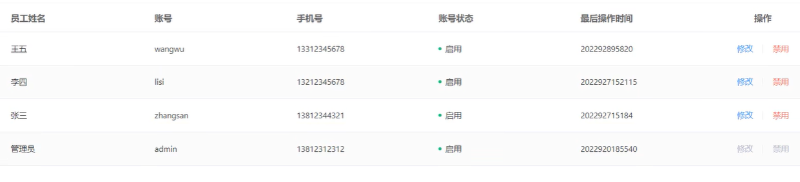
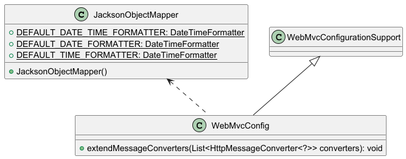

# SpringMVC的消息转换器

> **参考视频或文章**：
>
> + https://blog.csdn.net/m0_50742275/article/details/144899648?fromshare=blogdetail&sharetype=blogdetail&sharerId=144899648&sharerefer=PC&sharesource=2401_83600210&sharefrom=from_link

## 一、技术介绍

### 1.概述

+ SpringMVC的消息转换器(Message Converter)是Spring框架中用于处理HTTP请求体或响应体与Java对象之间转换的组件。
+ 让开发人员可以轻松地将HTTP请求的数据映射到方法参数，并将返回的对象转换为HTTP响应。

### 2.工作原理

当一个HTTP请求到达SpringMVC应用程序时，Spring框架会根据该请求的`Content-Type`（内容类型）和`Accept`（接受类型）来选择合适的消息转换器。

例如：客户端发送了一个JSON格式的POST请求，那么SpringMVC会选择`MappingJackson2HttpMessageConverter`这一消息转换器来将请求体反序列化为Java对象；当方法返回一个Java对象并需要将其发送给客户端时，SpringMVC仍会使用这一消息转换器来将这个Java对象序列化为JSON格式的响应体。

### 3.常见的内置消息转换器

|                消息转换器                |                     功能                      |                        依赖/适用场景                         |
| :--------------------------------------: | :-------------------------------------------: | :----------------------------------------------------------: |
|  `MappingJackson2HttpMessageConverter`   |    支持JSON格式的HTTP消息序列化与反序列化     |                        依赖Jackson库                         |
| `MappingJackson2XmlHttpMessageConverter` |     支持XML格式的HTTP消息序列化与反序列化     |                        依赖Jackson库                         |
|       `StringHttpMessageConverter`       |        处理纯文本字符串类型的HTTP消息         |                无特殊依赖，适用于文本传输场景                |
|        `FormHttpMessageConverter`        |          处理表单数据格式的HTTP消息           | 支持`application/x-www-form-urlencoded`和`multipart/form-data`类型，可用于标准表单提交和文件上传 |
|     `ByteArrayHttpMessageConverter`      |         处理二进制数据格式的HTTP消息          |           适用于图片传输、文件下载等二进制数据场景           |
|  `Jaxb2RootElementHttpMessageConverter`  |         实现XML数据的序列化与反序列化         |                         基于JAXB API                         |
|       `SourceHttpMessageConverter`       | 处理基于`javax.xml.transform.Source`的XML消息 |                  适用于XML源数据的传输场景                   |
|      `ResourceHttpMessageConverter`      |          处理资源文件类型的HTTP消息           |                 适用于文件下载等资源访问场景                 |


---


## 二、项目应用

### 1.项目需求

初步开发完员工管理模块的员工分页查询功能后，测试发现如下问题：



可以看到，最后操作时间的格式并不符合预期，这是因为后端响应给前端的日期时间数据没有进行格式化处理。

解决方法有以下2种：

+ **单个处理**：在相关属性上加上`@JsonFormat(pattern="")`注解，对日期时间进行格式化处理；

+ **统一处理**：在`WebMvcConfig`中扩展SpringMVC的消息转换器，统一对日期时间类型的数据进行格式化处理。


### 2.扩展SpringMVC的消息转换器

涉及到的文件如下：

```yml
sky-common:
	json: JacksonObjectMapper

sky-server:
	config: WebMvcConfig
```




#### 2.1 创建对象转换器`JacksonObjectMapper`

```java
/**
 * 对象转换器：基于jackson将Java对象转为json，或者将json转为Java对象
 * 将JSON解析为Java对象的过程称为 [从JSON反序列化Java对象]
 * 从Java对象生成JSON的过程称为 [序列化Java对象到JSON]
 */
public class JacksonObjectMapper extends ObjectMapper {

    public static final DateTimeFormatter DEFAULT_DATE_TIME_FORMATTER = DateTimeFormatter.ofPattern("yyyy-MM-dd HH:mm:ss");
    public static final DateTimeFormatter DEFAULT_DATE_FORMATTER = DateTimeFormatter.ofPattern("yyyy-MM-dd");
    public static final DateTimeFormatter DEFAULT_TIME_FORMATTER = DateTimeFormatter.ofPattern("HH:mm:ss");

    public JacksonObjectMapper() {
        super();
        // 收到未知属性时不报异常
        this.configure(FAIL_ON_UNKNOWN_PROPERTIES, false);

        // 反序列化时，属性不存在的兼容处理
        this.getDeserializationConfig().withoutFeatures(DeserializationFeature.FAIL_ON_UNKNOWN_PROPERTIES);

        SimpleModule simpleModule = new SimpleModule()
                .addDeserializer(LocalDateTime.class, new LocalDateTimeDeserializer(DEFAULT_DATE_TIME_FORMATTER))
                .addDeserializer(LocalDate.class, new LocalDateDeserializer(DEFAULT_DATE_FORMATTER))
                .addDeserializer(LocalTime.class, new LocalTimeDeserializer(DEFAULT_TIME_FORMATTER))
                .addSerializer(LocalDateTime.class, new LocalDateTimeSerializer(DEFAULT_DATE_TIME_FORMATTER))
                .addSerializer(LocalDate.class, new LocalDateSerializer(DEFAULT_DATE_FORMATTER))
                .addSerializer(LocalTime.class, new LocalTimeSerializer(DEFAULT_TIME_FORMATTER));

        // 注册功能模块：例如，可以添加自定义序列化器和反序列化器
        this.registerModule(simpleModule);
    }
}
```


#### 2.2 在`WebMvcConfig`中扩展SpringMVC的消息转换器

```java
/**
 * 配置类，注册web层相关组件
 */
@Configuration
public class WebMvcConfig extends WebMvcConfigurationSupport {

    // 设置静态资源映射
    @Override
    protected void addResourceHandlers(ResourceHandlerRegistry registry) {
        registry.addResourceHandler("/doc.html").addResourceLocations("classpath:/META-INF/resources/");
        registry.addResourceHandler("/webjars/**").addResourceLocations("classpath:/META-INF/resources/webjars/");
    }


    // 扩展SpringMVC消息转换器，统一对日期时间类型进行格式化处理
    @Override
    protected void extendMessageConverters(List<HttpMessageConverter<?>> converters) {
        // 创建一个消息转换器对象
        MappingJackson2HttpMessageConverter converter = new MappingJackson2HttpMessageConverter();
        // 设置对象转换器，可以将Java对象序列化为json字符串
        converter.setObjectMapper(new JacksonObjectMapper());
        // 将我们设置的对象转换器放入SpringMVC的消息转换器中的第一位置，最优先使用
        converters.add(0, converter);
    }
}
```


