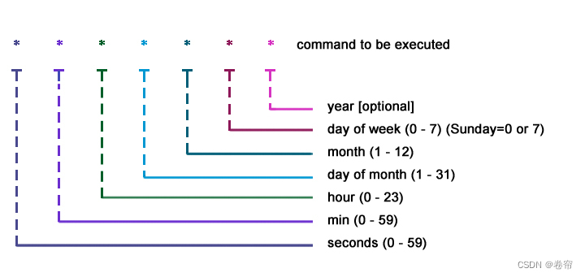

# SpringTask

> **参考视频或文章**：
>
> + https://blog.csdn.net/SRY12240419/article/details/140656360?fromshare=blogdetail&sharetype=blogdetail&sharerId=140656360&sharerefer=PC&sharesource=2401_83600210&sharefrom=from_link
> + https://blog.csdn.net/yuanmayuzhou/article/details/131417682?fromshare=blogdetail&sharetype=blogdetail&sharerId=131417682&sharerefer=PC&sharesource=2401_83600210&sharefrom=from_link
> + https://blog.csdn.net/qq_40959369/article/details/129434036?fromshare=blogdetail&sharetype=blogdetail&sharerId=129434036&sharerefer=PC&sharesource=2401_83600210&sharefrom=from_link

## 一、技术介绍

### 1.入门

SpringTask是Spring框架提供的任务调度工具，可以按照约定的时间自动执行某个代码逻辑。

在无任何第三方依赖的情况下，SpringBoot默认使用`spring-context`模块提供的定时任务工具SpringTask，我们只需要在项目启动类`XxxApplication`加上`@EnableScheduling`注解就可以开启基于注解的定时任务功能：

```java
@SpringBootApplication
@EnableScheduling// 开启注解方式的定时任务功能
public class SkyApplication {
    public static void main(String[] args) {
        SpringApplication.run(SkyApplication.class, args);
        log.info("server starts ...");
    }
}
```


---


### 2.cron表达式

#### 2.1 概述

cron表达式是一种由6或7个域组成的字符串，用于表示定时任务的执行时间，每个域代表一种时间单位：



#### 2.2 通配符

| 通配符 |                             说明                             |                             举例                             |
| :----: | :----------------------------------------------------------: | :----------------------------------------------------------: |
|  `*`   |             表示匹配该域的任意值，可解读为“每”。             |         在秒域使用`*`，则表示每秒都会触发定时任务。          |
|  `?`   | 表示不指定该域的值，只能用于日域和周域，通常在不需要关心当前域时使用该通配符。 | 若我们想在每月8号触发任务，但不关心是周几，就可以这么设置：`“0 0 0 8 * ?”`。 |
|  `-`   |                   表示指定该域的连续范围。                   |     在分域使用`7-13`，则表示从7分到13分每分钟触发一次。      |
|  `/`   | 表示将该域的表达式分割为两部分，第一部分表示起始时间，第二部分表示间隔时间。 |    在秒域使用`4/8`，则表示从第4秒开始，每隔8秒触发一次。     |
|  `,`   |                    表示匹配该域的指定值。                    | 在分域使用`8,12,35`，则表示分别在第8分、第12分、 第35分执行该定时任务。 |
|  `L`   | LAST，只能用于日域和周域，在L前加上数字则表示该数据的最后一个。 | 在周域使用`5L`，意味着在最后一个星期四触发（周日是每周的第一天）。 |
|  `W`   | WORKDAY，表示有效工作日，即周一到周五，只能用于日域且只能用于具体数字之后，系统将在离指定日期最近的有效工作日触发定时任务。**注意**：不会跨过月份。 | 在日域使用`5W`，如果5号在星期一到星期五中的一天，则就在5号触发；如果5号是星期六，则在4号（星期五）触发；如果5号是星期天，则在6号（星期一）触发。 |
|  `LW`  | LAST WORKDAY，表示在某个月的最后一个工作日，即最后一个星期五。 |                             略。                             |
|  `#`   | 用于确定每个月第几个周几，只能出现在周域。第一部分表示周几，第二部分表示每月第几个。 |           `2#4`表示在每月的第4个周一触发定时任务。           |


---


### 3.创建定时任务——`@Scheduled`

如果我们要创建一个定时任务，那么就要用到`@Scheduled`注解，它可以直接加在无返回值无形参的方法上面，表示该方法根据注解规则定时执行任务。

`@Scheduled`注解主要支持以下三种方式，且这三种方式必须且只能出现其中一个：

+ **cron表达式**：`@Scheduled(cron = "")`
+ **固定延时**：`@Scheduled(initialDelay = , fixedDelay = )`，表示延迟`initalDelay`毫秒后第一次执行任务，以上一次任务**执行结束**的时间点为基准，延迟`fixedDelay`毫秒后执行下一次任务。
+ **固定速率**：
  + `@Scheduled(initialDelay = , fixedRate = )`，表示延迟`initalDelay`毫秒后第一次执行任务，以上一次任务**开始执行**的时间点为基准，延迟`fixedRate`毫秒后执行下一次任务。
  + 如果上一次任务的执行时间超过`fixedRate`毫秒，下一次任务会等待当前任务结束后立即执行（默认单线程下）；如果是多线程配置，可能会并发执行。


---


## 二、项目应用

### 1.项目需求

用户下单后可能存在的两种情况：

+ 下单后用户未支付，订单一直处于“待支付”状态。
+ 骑手送达后管理端没有及时点击完成按钮，订单一直处于“派送中”状态。

针对以上两种情况，我们需要设置定时任务来修改订单状态：

+ 每分钟检查是否存在超时未付款的订单，若存在则将该订单状态修改为“已取消”。
+ 每天凌晨一点检查是否存在一直在派送中的订单，若存在则将该订单状态修改为“已完成”。


### 2.设置定时任务

涉及到的文件如下：

```yml
sky-take-out: pom.xml

sky-server:
	pom.xml
	src/main/java/com.zsh:
		SkyApplication
		task: OrderTask
```


#### 2.1 导入SpringTask的`Maven`依赖坐标

+ `sky-take-out: pom.xml`:

  ```xml
  <?xml version="1.0" encoding="UTF-8"?>
  <project xmlns="http://maven.apache.org/POM/4.0.0"
           xmlns:xsi="http://www.w3.org/2001/XMLSchema-instance"
           xsi:schemaLocation="http://maven.apache.org/POM/4.0.0 http://maven.apache.org/xsd/maven-4.0.0.xsd">
      <modelVersion>4.0.0</modelVersion>
      <parent>
          <artifactId>spring-boot-starter-parent</artifactId>
          <groupId>org.springframework.boot</groupId>
          <version>2.7.3</version>
      </parent>
      <groupId>com.sky</groupId>
      <artifactId>sky-take-out</artifactId>
      <packaging>pom</packaging>
      <version>1.0-SNAPSHOT</version>
      <modules>
          <module>sky-common</module>
          <module>sky-pojo</module>
          <module>sky-server</module>
      </modules>
  </project>
  ```

+ `sky-server: pom.xml`:

  ```xml
  <?xml version="1.0" encoding="UTF-8"?>
  <project xmlns="http://maven.apache.org/POM/4.0.0"
           xmlns:xsi="http://www.w3.org/2001/XMLSchema-instance"
           xsi:schemaLocation="http://maven.apache.org/POM/4.0.0 http://maven.apache.org/xsd/maven-4.0.0.xsd">
      <parent>
          <artifactId>sky-take-out</artifactId>
          <groupId>com.sky</groupId>
          <version>1.0-SNAPSHOT</version>
      </parent>
      <modelVersion>4.0.0</modelVersion>
      <artifactId>sky-server</artifactId>
      <dependencies>
  
          <dependency>
              <groupId>com.sky</groupId>
              <artifactId>sky-common</artifactId>
              <version>1.0-SNAPSHOT</version>
          </dependency>
          <dependency>
              <groupId>com.sky</groupId>
              <artifactId>sky-pojo</artifactId>
              <version>1.0-SNAPSHOT</version>
          </dependency>
  
          <dependency>
              <groupId>org.springframework.boot</groupId>
              <artifactId>spring-boot-starter</artifactId>
          </dependency>
          <dependency>
              <groupId>org.springframework.boot</groupId>
              <artifactId>spring-boot-starter-test</artifactId>
              <scope>test</scope>
          </dependency>
          <dependency>
              <groupId>org.springframework.boot</groupId>
              <artifactId>spring-boot-starter-web</artifactId>
              <scope>compile</scope>
          </dependency>
  
      </dependencies>
  
      <build>
          <plugins>
              <plugin>
                  <groupId>org.springframework.boot</groupId>
                  <artifactId>spring-boot-maven-plugin</artifactId>
              </plugin>
          </plugins>
      </build>
  
  </project>
  ```


---


#### 2.2 在项目启动类`SkyApplication`上开启注解方式的定时任务功能

```java
@SpringBootApplication
@EnableScheduling// 开启注解方式的定时任务功能
public class SkyApplication {
    public static void main(String[] args) {
        SpringApplication.run(SkyApplication.class, args);
    }
}
```


---


#### 2.3 编写订单定时任务类`OrderTask`

```java
/**
 * 订单定时任务类：定时处理订单状态
 */
@Component
public class OrderTask {

    @Autowired
    private OrderService orderService;

    // 定时处理超时未付款的订单
    @Scheduled(cron = "0 * * * * ?")// 每分钟的0秒触发一次
    public void handleTimeoutOrders() {
        orderService.cancelTimeoutOrders();
    }

    // 定时处理一直在派送中的订单
    @Scheduled(cron = "0 0 1 * * ? ")// 每日凌晨1点触发一次
    public void handleDeliveryOrders() {
        orderService.completeDeliveryOrders();
    }
}
```

