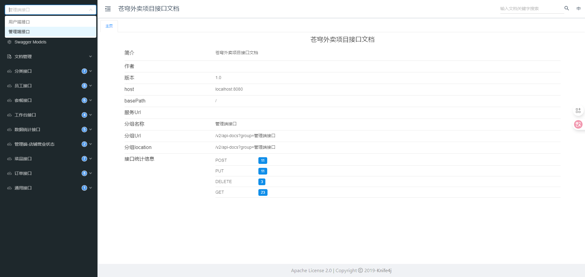

# Swagger+Knife4j

> **参考视频或文章**：
>
> + https://www.runoob.com/swagger/swagger-tutorial.html
> + https://www.runoob.com/swagger/swagger-intro.html

## 一、技术介绍

### 1.OpenAPI规范

OpenAPI规范（旧称Swagger规范），是一种与语言无关的标准，用于描述RESTful API。它使用yaml或json格式定义API的端点、操作、参数、请求/响应格式和认证方法。


### 2.Swagger

#### 2.1 概述

+ Swagger是由SmartBear Software提供一套用于设计、构建、文档化和测试RSETful API的开源工具集，核心是OpenAPI规范。
+ Swagger提供了一种标准化的方式来描述API的结构、请求参数和响应格式等信息，使得前后端开发人员能够更高效地协作。
+ Swagger最初是独立的API规范，现在已经成为OpenAPI Specification的基础。

#### 2.2 Swagger的三大核心组件

+ **Swagger UI**：一个可视化工具，可以将OpenAPI规范呈现为交互式API文档，它允许程序员直接在浏览器中查看和测试API。
+ **Swagger Editor**：一个基于浏览器的在线编辑器，用于编写OpenAPI规范，能够实时预览和验证功能。
+ **Swagger Codegen**：一个代码生成工具，可以根据OpenAPI规范API自动生成服务端存根和客户端SDK。

#### 2.3 Swagger的优势

+ **标准化的API文档**：Swagger提供了一种统一格式如OpenAPI规范来描述API，避免了文档不一致的问题。
+ **提高开发效率**：前后端开发人员可以并行工作，前端开发无需等待后端API完成即可动手开发。
+ **自动化测试**：通过Swagger UI，程序员可以直接在浏览器中测试API，无需额外工具。
+ **代码自动生成**：Swagger Codegen可以自动生成客户端SDK，减少手动编写代码的工作量。


### 3.Knife4j

#### 3.1 概述

+ Knife4j是一个用于生成、展示和增强API接口文档的**国产开源工具**，主要应用于Java后端项目。
+ Knife4j基于OpenAPI规范，并在Swagger原有能力的基础上，提供了更美观的UI、更强的功能和更好的使用体验。

#### 3.2 主要功能

+ **自动生成接口文档**：根据Controller接口和Swagger注解，自动解析接口路径、请求方式（GET、POST等）、请求参数和返回结果，避免手写接口文档，实现“**代码即文档**”。
+ **更美观的UI**：相比原生Swagger UI，页面布局更清晰，支持接口搜索和接口分组。
+ **在线接口调试**：可以直接在文档页面填写参数，一键发送请求，实时查看返回结果。
+ **微服务文档聚合**：适合多模块的后端项目。
+ **导出离线文档**：可以将接口文档导出为Markdown、HTML等多种格式，便于撰写技术文档。

#### 3.3 对比

|     功能     | Swagger | Knife4j |
| :----------: | :-----: | :-----: |
| 接口文档生成 |  手动   |  自动   |
|      UI      |  基础   | 更美观  |
|   在线调试   |  基础   |  更强   |
|   接口分组   |  有限   |  支持   |
|   文档导出   |    ×    |    ✓    |
|  微服务聚合  |    ×    |    ✓    |


---


## 二、项目应用

涉及到的文件如下：

```yml
sky-take-out: pom.xml

sky-server:
	pom.xml
	config: WebMvcConfig
```


### 1.导入`Knife4j`的`Maven`依赖坐标

#### 1.1 `sky-take-out: pom.xml`

```xml
<?xml version="1.0" encoding="UTF-8"?>
<project xmlns="http://maven.apache.org/POM/4.0.0"
         xmlns:xsi="http://www.w3.org/2001/XMLSchema-instance"
         xsi:schemaLocation="http://maven.apache.org/POM/4.0.0 http://maven.apache.org/xsd/maven-4.0.0.xsd">
    <modelVersion>4.0.0</modelVersion>
    <parent>
        <artifactId>spring-boot-starter-parent</artifactId>
        <groupId>org.springframework.boot</groupId>
        <version>2.7.3</version>
    </parent>
    
    <groupId>com.sky</groupId>
    <artifactId>sky-take-out</artifactId>
    <packaging>pom</packaging>
    <version>1.0-SNAPSHOT</version>
    
    <modules>
        <module>sky-common</module>
        <module>sky-pojo</module>
        <module>sky-server</module>
    </modules>
    
    <properties>
        <knife4j>3.0.2</knife4j>
    </properties>
    
    <dependencyManagement>
        <dependencies>
			<dependency>
                <groupId>com.github.xiaoymin</groupId>
                <artifactId>knife4j-spring-boot-starter</artifactId>
                <version>${knife4j}</version>
            </dependency>
        </dependencies>
    </dependencyManagement>
</project>
```

#### 1.2 `sky-server: pom.xml`

```xml
<?xml version="1.0" encoding="UTF-8"?>
<project xmlns="http://maven.apache.org/POM/4.0.0"
         xmlns:xsi="http://www.w3.org/2001/XMLSchema-instance"
         xsi:schemaLocation="http://maven.apache.org/POM/4.0.0 http://maven.apache.org/xsd/maven-4.0.0.xsd">
    <parent>
        <artifactId>sky-take-out</artifactId>
        <groupId>com.sky</groupId>
        <version>1.0-SNAPSHOT</version>
    </parent>
    <modelVersion>4.0.0</modelVersion>
    <artifactId>sky-server</artifactId>
    <dependencies>
        <dependency>
            <groupId>com.sky</groupId>
            <artifactId>sky-common</artifactId>
            <version>1.0-SNAPSHOT</version>
        </dependency>
        <dependency>
            <groupId>com.sky</groupId>
            <artifactId>sky-pojo</artifactId>
            <version>1.0-SNAPSHOT</version>
        </dependency>

        <dependency>
            <groupId>org.springframework.boot</groupId>
            <artifactId>spring-boot-starter</artifactId>
        </dependency>
        <dependency>
            <groupId>org.springframework.boot</groupId>
            <artifactId>spring-boot-starter-test</artifactId>
            <scope>test</scope>
        </dependency>
        <dependency>
            <groupId>org.springframework.boot</groupId>
            <artifactId>spring-boot-starter-web</artifactId>
            <scope>compile</scope>
        </dependency>
    
        <dependency>
            <groupId>com.github.xiaoymin</groupId>
            <artifactId>knife4j-spring-boot-starter</artifactId>
        </dependency> 
    </dependencies>

    <build>
        <plugins>
            <plugin>
                <groupId>org.springframework.boot</groupId>
                <artifactId>spring-boot-maven-plugin</artifactId>
            </plugin>
        </plugins>
    </build>

</project>
```


---


### 2.在`WebMvcConfig`中编写`Knife4j`生成接口文档的相关配置

```java
/**
 * 配置类，注册web层相关组件
 */
@Configuration
public class WebMvcConfig extends WebMvcConfigurationSupport {

    // 设置静态资源映射
    @Override
    protected void addResourceHandlers(ResourceHandlerRegistry registry) {
        log.info("开始设置静态资源映射...");
        registry.addResourceHandler("/doc.html").addResourceLocations("classpath:/META-INF/resources/");
        registry.addResourceHandler("/webjars/**").addResourceLocations("classpath:/META-INF/resources/webjars/");
    }

    //Logic: 注册Swagger文档生成器Docket，通过Knife4j生成接口文档
    // 管理端接口
    @Bean("adminDocket")// 手动指定Bean名称，防止冲突
    public Docket adminDocket() {
        log.info("准备生成管理端接口文档...");
        ApiInfo apiInfo = new ApiInfoBuilder()
                .title("苍穹外卖项目接口文档")
                .version("1.0")
                .description("苍穹外卖项目接口文档")
                .build();
        Docket adminDocket = new Docket(DocumentationType.SWAGGER_2)
                .groupName("管理端接口")
                .apiInfo(apiInfo)
                .select()
                .apis(RequestHandlerSelectors.basePackage("com.sky.controller.admin"))// 扫描管理端接口所在的包
                .paths(PathSelectors.any())
                .build();
        return adminDocket;
    }

    // 用户端接口
    @Bean("userDocket")
    public Docket userDocket() {
        log.info("准备生成用户端接口文档...");
        ApiInfo apiInfo = new ApiInfoBuilder()
                .title("苍穹外卖项目接口文档")
                .version("1.0")
                .description("苍穹外卖项目接口文档")
                .build();
        Docket userDocket = new Docket(DocumentationType.SWAGGER_2)
                .groupName("用户端接口")
                .apiInfo(apiInfo)
                .select()
                .apis(RequestHandlerSelectors.basePackage("com.sky.controller.user"))// 扫描用户端接口所在的包
                .paths(PathSelectors.any())
                .build();
        return userDocket;
    }
}
```


---


### 3.启动项目后查看生成的接口文档

访问http://localhost:8080/doc.html，即可跳转到接口文档。



